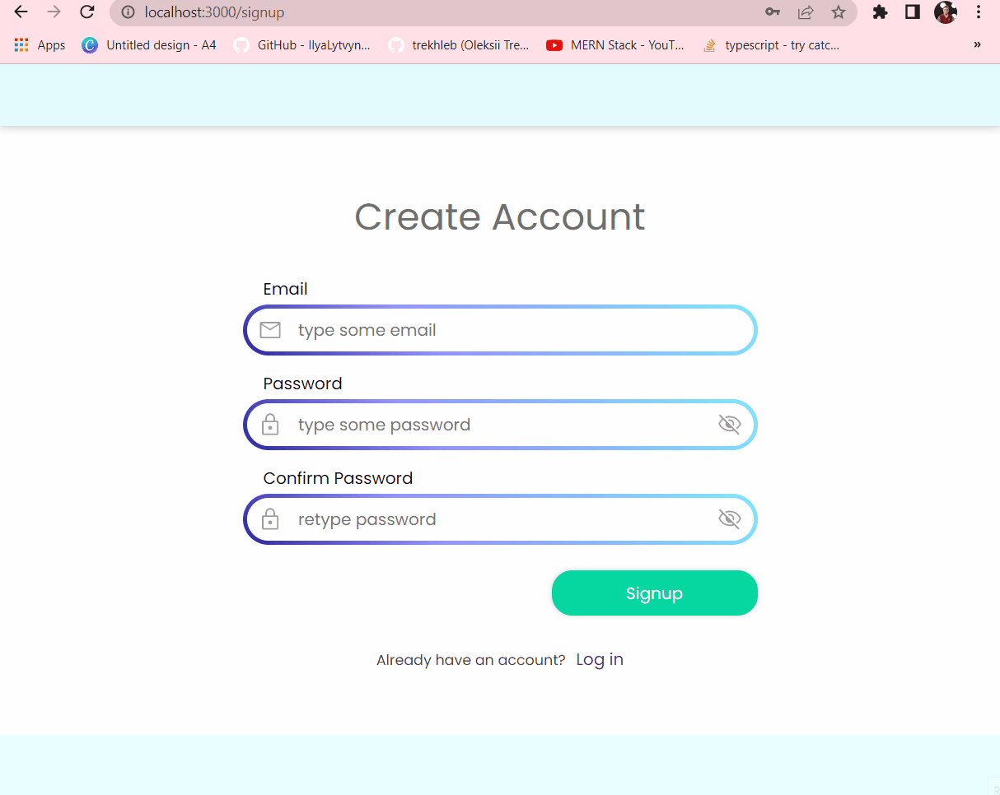
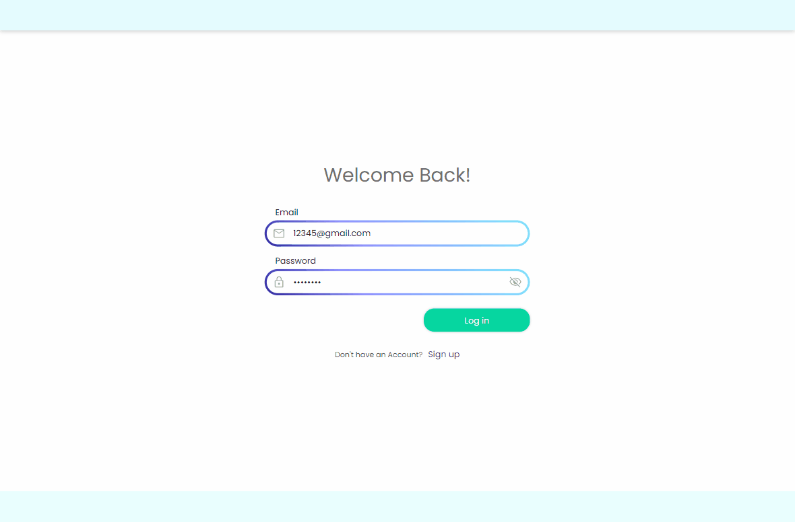

node version: 18.x

backend: npm install  -->  npm run dev;
frontend: npm install --> npm start;

MERN TODO APP

backend: 
  * yup --> req.body validation
  * JsonWebToken --> user authentification through req.header.authorisation

frontend: 
  * Redux Toolkit --> state management
  * HttP service class --> axios http request management
  * Styled components --> instead of css files
  * Formik and yup --> form management

  auth demo

  CRUD demo
